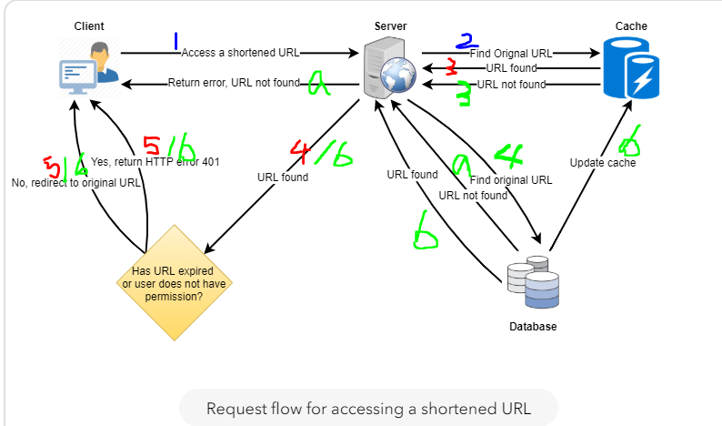

# Algorithm

https://leetcode.com/problems/implement-trie-prefix-tree

Presuming the character set is only within [a-z]. Trie tree is not applicable to use if the character set is too large.

- The data structure definition

  - Character is not a must, but without the parent, the node cannot tell what it represents
  - IsEndingChar is must, to tell the difference between a whole word exist or just the prefix exist

```
type Trie struct {
    Character rune
    Children [26]*Trie
    IsEndingChar bool
}


/** Initialize your data structure here. */
func Constructor() Trie {
    return Trie{
    }
}


/** Inserts a word into the trie. */
func (this *Trie) Insert(word string)  {
    cur:=this
    for _, ch:=range word{
        inx:= ch-'a'
        if cur.Children[inx] == nil{
            cur.Children[inx] = &Trie{
                Character: ch,
            }
        }
        cur = cur.Children[inx]
    }
    cur.IsEndingChar = true
}


/** Returns if the word is in the trie. */
func (this *Trie) Search(word string) bool {
    cur:=this
    for _, ch:=range word{
        if cur.Children[ch-'a']== nil{
            return false
        }
        cur = cur.Children[ch-'a']
    }
    if cur.IsEndingChar{
        return true
    }
    return false
}


/** Returns if there is any word in the trie that starts with the given prefix. */
func (this *Trie) StartsWith(prefix string) bool {
    cur:=this
    for _, ch:=range prefix{
        if cur.Children[ch-'a']== nil{
            return false
        }
        cur = cur.Children[ch-'a']
    }
    return true
}

```

# Review

[Designing a URL Shortening service like TinyURL
](https://www.educative.io/courses/grokking-the-system-design-interview/m2ygV4E81AR)

This is one of the system design questions in that series, and one of the very few which are free to read.

To address the question in a systematically is not easy. The estimation part is impressive. This part is not taught in any school courses, but is necessary when facing real problems.

1. Description. Making short alias url for long ones. (Use case: for easier sharing in social media, since some used to have length limitation in each post, eg. twitter, weibo)

2. Requirement

- functional

  - given a url, get a shorten one
  - given a shorten url, it can redirect to the original link
  - user can pick a custom short link
  - link expire after some time. User can specify the expiration time.

- non-functional

  - high-availability, else all short links are not usable
  - minimal latency
  - shortened link not guessable

- extended

  - analytics: how many times a redirect happened
  - the service is accessible with REST api.

3. Estimation
   Presume more read than write at a 100:1 ratio, 500 bytes per URL mapping, 500M new short url generating per month,

Traffic estimation:
Redirect/Read QPS = 500 \* 500M \* 100 /30/24/3600 =~ 10MB/s

Storage estimation:
Assuming store each short URL for 5 years,
500M \* 12 \* 5 = 30B URLs
Storage size = 500 \* 500M \* 12 \* 5 = 15 TB

Bandwidth estimation:
Outgoing traffic = Read QPS = 10MB/s
Incoming traffic = Write QPS = 1/100 Read QPS = 100KB/s

Memory estimation:
If caching some hot URLs in memory, 20% of the URLs generating 80% of the traffic. Caching size for a day:
10MB/s \* 0.2 \* 3600 \* 24 ~= 170GB

4. System APIs

```
createURL(api_dev_key, original_url, custom_alias=None, user_name=None, expire_date=None) (short_url, error)
deleteURL(api_dev_key, url_key)(error)
```

Each api_dev_key can be limited to a certain number of URL creations and redirections per some time period (which may be set to a different duration per developer key).

5. Database Design

One table records url mapping.

| URL Table       |              |     |
| --------------- | ------------ | --- |
| short_url       | varchar(16)  | PK  |
| original_url    | varchar(512) |     |
| creation_date   | datetime     |     |
| expiration_date | datetime     |     |
| uid             | int          | FK  |

The other table records user.

| User Table  |              |     |
| ----------- | ------------ | --- |
| uid         | int          | PK  |
| api_dev_key | varchar(512) |     |
| lastlogin   | datetime     |     |

Considering the size of data, should consider NO-SQL database.

6. Basic Design and Algorithm

a. Encoding actual URL on the fly
Using base64 encoding [a-zA-Z0-9-.], 64^6 = 68.7B > 30B (for 5 years storage), which is sufficient for the system.

hash(MD5) -> encode(base64) generates 21 characters -> takes the first 6 letters -> handle duplicates (find the next available one, double hash etc)

Problem:
Multiple user enter same URL, but get same short url -> append user ID


b. Generating short URL offline
Pregenerate random 6 letter strings beforehand and store those into a database. When a string is used, marked it.

Concurrency issue: multiple application server, one database. Each app server can fetch a bunch of keys and store them in memory, and marked those as used. If app dies, then losing those keys, which is fine because the amount of the pregenerated keys are suffice even losing some.

Single point of failure: the database can be replicated to a standby server.

7. Data Partition and Replication
   a. Partition based on first letter of the short url -> can lead to unbalanced partitions
   b. consistent hashing

8. Cache

- memcache/redis
- what to cache? based on clients' usage pattern, store 20% most hot URLs, which is 170GB per day based on the above calculation
- cache eviction policy: LRU, always put recently used one at the beginning of the linked list.
- cache update: when there is a cache miss, fetch from db, and update the cache, and pass the new entry to all cache replicas.



9. Load Balancing

1) between client and app server
2) between app server and db server
3) between app server and cache server

policy: round-robin/ adjust traffic base on load

10. Purging / DB Cleanup
    Cleaning up expired short URLs:

- Periodic clean up service
- When user hit a short URL, and find it expired, marked it deleted
- After delete, put it back to unused state

11. Telemetry
    stats that worth tracking: request count per short url, location/platform/datetime of visitor, web page that refers the short url.

12. Security and Permissions
    User create private URLs, and choose whom to share -> create another column at the URL table storing allowed user IDs.


# Tips

```
cat file1 > file1
```

results in an empty file.
This happened because the `>` does is to create the file it wants to write to, and if the file already exists, its contents will be deleted.

The solution, redirect to a temp file, and after modification, copy it back to the original name.

# Share
